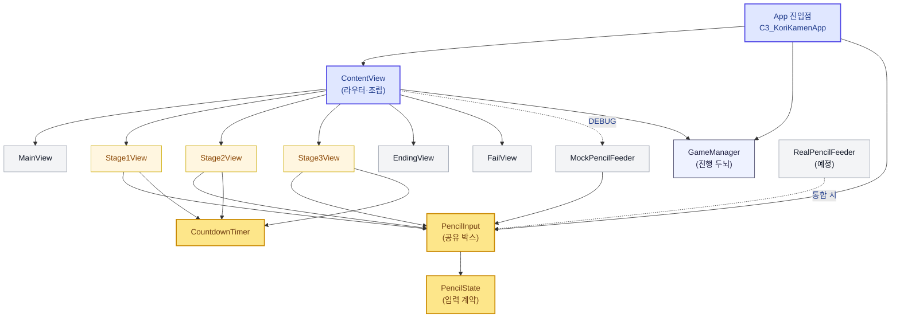

# 아키텍처

> 한눈 요약은 루트 `CLAUDE.md` 참고. 이 문서는 폴더 구조와 계층 설계의 *근거*를 담는다.

## 1. 설계 원칙 — 2층 구조 (Core + Stages)

선형 게임이라 스테이지를 1인 1개로 나누지만, 세 스테이지는 **타이머·HUD·연출·전환·펜슬 입력을 공유**한다. 따라서 "스테이지별 완전 격리"가 아니라 다음 2층으로 둔다.

- **Core (공통 토대)** — 모든 스테이지가 의존. 먼저 계약을 합의/구현하고, 한 명이 오너십을 갖는다.
- **Stages (피처)** — 한 명이 한 스테이지를 Core 위에 얹어 **병렬로** 개발한다.

> 오너십을 폴더 경계와 일치시켜 머지 충돌을 최소화한다 (각자 `Stages/StageN_*`만 수정).

## 2. 폴더 구조

```
C3_Korikamen/
├── App/
│   ├── C3_KorikamenApp.swift     # @main (SwiftUI App) ← 템플릿에서 전환
│   └── RootView.swift            # game.phase 따라 스토리/스테이지 분기
├── Core/                         # 공통 토대 (먼저 합의/구현, 1명 오너)
│   ├── GameManager.swift         # ObservableObject, GKStateMachine, recordTime
│   ├── StageStates.swift         # GKState 서브클래스 (Story/Stage1~3/Ending)
│   └── StageContract.swift       # onClear/onFail 등 스테이지 공통 계약
├── PencilInput/                  # 애플펜슬 입력 (Port/Adapter, 1명 오너)
│   ├── PencilState.swift         # 데이터 계약
│   ├── PencilInput.swift         # 관찰 대상(ObservableObject)
│   ├── RealPencilFeeder.swift    # 실기기 어댑터
│   └── MockPencilFeeder.swift    # 시뮬레이터 스텁
├── CommonUI/                     # 공통 뷰 컴포넌트
│   ├── TimerHUDView.swift
│   ├── GaugeView.swift           # value: 0...1 만 받는 '껍데기'
│   └── StageResultView.swift     # 성공/실패 연출
├── Common/
│   ├── CountdownTimer.swift      # Combine Timer.publish 래퍼
│   └── FeedbackPlayer.swift      # 사운드/햅틱
├── Stages/
│   ├── Stage1_Rock/   (맥스)
│   ├── Stage2_Lock/   (실라)
│   └── Stage3_Spider/ (노튼)
├── Story/                        # 인트로/엔딩 컷
└── Resources/                    # 에셋 (Stage1/2/3 하위 폴더로)
```

## 3. 기술 스택 매핑

| 프레임워크 | 사용 위치 |
| --- | --- |
| SwiftUI | `App/`, 모든 `*View`, 상태 바인딩 |
| GameplayKit | `Core/` 스테이지 전환(`GKStateMachine`) |
| UIKit | `PencilInput/RealPencilFeeder` (펜슬 raw 입력) |
| SpriteKit | 스테이지 연출(거미줄/돌 레이어), SwiftUI에 `SpriteView`로 임베드 |
| Combine | `Common/CountdownTimer`, 게이지 스트림 |

## 4. 공통으로 뺄 것 vs 빼면 안 되는 것 ⚠️

| ✅ 공통화 (Core/CommonUI) | ❌ 공통화 금지 (스테이지별) |
| --- | --- |
| 타이머, HUD, 성공/실패 연출, 사운드 | 각 스테이지의 **판정 로직** |
| 게이지의 *겉모습*(`GaugeView(value:)`) | 게이지를 *채우는 규칙* |
| 펜슬 입력 계약, 스테이지 전환 | 스테이지별 에셋/씬 레이아웃 |

> **Rule of Three**: 드릴 HP감소 / Tilt범위 3초유지 / 스퀴즈 70~85%는 겉만 "게이지"지 알맹이가 전혀 다르다. 2개가 비슷해 보인다고 미리 추상화하지 말고, **진짜 똑같은 게 3번 나오면** 그때 끌어올린다. 데이터는 단순 숫자로, 채우는 규칙은 각 스테이지가 갖는다.

## 5. 스테이지 전환 — GameManager + GKStateMachine

`GKStateMachine`이 **진실의 원천**, `currentPhase`는 SwiftUI 표시용 *복사본*. 각 스테이지 뷰는 클리어 시 `onClear()`만 호출하면 된다.

```swift
// Core/GameManager.swift (골격 — 실제 구현에서 살 붙임)
import GameplayKit
import Combine

enum GamePhase: Equatable { case intro, stage(Int), ending }

final class GameManager: ObservableObject {
    @Published var phase: GamePhase = .intro       // 표시용 복사본
    var stageTimes: [Int: Double] = [:]            // [스테이지: 경과시간]
    var totalPlayTime: Double { stageTimes.values.reduce(0, +) }

    func recordTime(stage: Int, elapsed: Double) { stageTimes[stage] = elapsed }

    lazy var machine = GKStateMachine(states: [
        IntroState(self), Stage1State(self), Stage2State(self),
        Stage3State(self), EndingState(self),
    ])
    init() { machine.enter(IntroState.self) }

    /// 각 스테이지 클리어 시점에 호출 → 다음 단계로
    func advance() { /* 현재 상태 보고 다음 state로 enter */ }
}
```

**다듬은 점 (팀원 초안 대비):**
1. 스토리/엔딩까지 상태로 포함 (`intro → stage(1..3) → ending`).
2. 진실의 원천은 `machine` 하나. `phase`는 각 state의 `didEnter`에서만 갱신.
3. 스테이지 뷰는 `init(onClear:onFail:)` 계약으로 통일 → `docs/contracts`.
4. (참고) 3스테이지 선형이라 `GKStateMachine`은 다소 무겁지만, GameplayKit 학습 + 전환 규칙 명시화 이점이 있어 채택.

## 6. 모듈 의존 구조 — 팬인 · 팬아웃

화살표는 **"A가 B를 의존/사용한다"** 방향. (모듈 단위로 유지하고, 구조가 바뀔 때만 갱신)



### 읽는 법
- 🟨 **FAN-IN 허브 = `PencilInput`(→ `PencilState`)**: 스테이지 3개 + Mock/(예정)Real이 모두 수렴하는 **공유 의존**. 변경 시 전원에 파급 → **팀 합의 필요**. (계약 상세: `contracts/pencil-input.md`)
- 🟪 **FAN-OUT 허브 = `ContentView`**: 모든 화면을 조립하고 두뇌(`GameManager`)에 연결하는 **유일한 조립 지점**. 얇게(배선만) 유지한다.
- ✅ **건강 신호**: 스테이지끼리, 그리고 스테이지 → `GameManager` 직접 의존이 **없다** (클로저 `onClear`/`onFail`로만 연결). → 서로·두뇌로부터 독립 = 병렬 개발에 이상적.
- ⚠️ **적신호 감시**: 위 그림에 **없던 화살표**(예: `Stage2View`가 `Stage1View`를 import)가 생기면 결합도 문제 신호.

> 유지 원칙: **모듈 단위로만** 그린다(파일 단위 X). 구조가 바뀌는 PR에서만 함께 갱신한다(docs-as-code).
